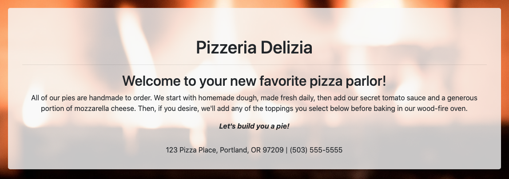

 

# Pizzeria Delilzia

### Place an order for a delicious, custom-made pizza.

### _By Micah Olson_

## Technologies Used
* HTML5
* CSS (extended by Bootstrap 4.5.3)
* JavaScript (extended by jQuery 3.5.1)

## Description
Select a size and any of a variety of toppings to see the price of, and place an order for, a delicious, custom, homemade pizza. The order will be waiting for you to pick up from your newest neighborhood pizza parlor, Pizzeria Delizia!  

## Setup and Installation
* This project's interactive web page can be viewed [here](https://micaholson.github.io/pizza-parlor).  

* To download, then view or edit a local copy yourself, follow the instructions below:  

  * Clone the repository to a local directory using the command-line tool `git` ([how to install git](https://www.learnhowtoprogram.com/introduction-to-programming/getting-started-with-intro-to-programming/git-and-github)).  
    `$ cd ~/[directory]/[path]/[of]/[choice]/`  
    `$ git clone https://github.com/MicahOlson/pizza-parlor.git`  
  
  * Navigate to the top level of the project directory.  
    `$ cd pizza-parlor/`   

  * To view the site locally, open the file called `index.html` in your default browser.  
    `$ open index.html`  

    * Alternatively, you can navigate to the project directory through your system's GUI file manager, then double-click `index.html` to open it in your default browser.  

  * To edit the project, open the files in your preferred code editor. Here are some recommendations:
    * [Visual Studio Code](https://code.visualstudio.com) - "Code editing. Redefined."
    * [Atom](https://atom.io) - "A hackable text editor for the 21st Century"
    * [SublimeText](https://www.sublimetext.com) - "A sophisticated text editor for code, markup and prose" 

## Tests
```
Describe: Pizza()
  Test: "It constructs a Pizza object."
  Code: let testPizza = new Pizza();
  Expect(testPizza).toEqual(Pizza {});

  Test: "It constructs a Pizza object with two properties, size and toppings."
  Code: let testPizza = new Pizza("", []);
  Expect(testPizza).toEqual(Pizza {size: "", toppings: []});

Describe: Pizza.prototype.sumCost()
  Test: "It returns the cost of a plain, cheese pizza based on size."
  Code: let testPizza = new Pizza("medium", []);
  Expect(testPizza.sumCost()).toEqual(15);

  Test: "It returns the cost of a pizza based on size and number of toppings."
  Code: let testPizza = new Pizza("medium", ["pepperoni", "artichoke", "onion"]);
  Expect(testPizza.sumCost()).toEqual(17.25);
```

## Known Bugs
* The order feature is only meant to simulate placing an order; it is not tied to a backend.
* If you find a bug, please report it to me at the email address below.

## License
[GPLv3](https://choosealicense.com/licenses/gpl-3.0/)\
Copyright &copy; 2021 Micah L. Olson

## Contact Information
Micah Olson micah.olson@protonmail.com